# HTML

## Introducción

### Objetivos

Bienvenidos a la primera clase de Plataforma 5! Los objetivos de esta clase son los siguientes:

- ¡Concernos entre nosotros!
- Entender como funciona internet
- Aprender los fundamentos de HTML:
  1. Qué es un tag
  2. Cómo se estructura un documento HTML
  3. Diferencia entre 'closing tag' y 'self closing tag'
  4. Tags con atributos
  5. Usar google como referencia constante
- Aramar un pequeño sitio y publicarlo

### ¿Inter-qué?

A lo largo de este curso (¡y en tu carrera como programador/a!) vamos a trabajar constantemente en internet, asi que es importante que empecemos entendiendo en líneas generales cómo funciona esta maravilla tecnológica. Veamos este video y charlemos sobre todo lo (increíble) que pasa cuando cargás una página web.

@youtube=ewrBalT_eBM

### Encontrando la dirección correcta

Cuando ingresamos una url en el navegador y apretamos enter, éste hace un request (un pedido) de la página que estamos buscando. Ese pedido es recibido por nuestro ISP (Internet Service Provider), osea Fibertel, Arnet, etc., que transforma el nombre de la página escrita en palabras (ej. www.google.com) en una dirección IP (Internet Protocol) a través de un sistema llamado DNS (Domain Name System) que traduce los nombres "humanos" de las páginas a direcciones electrónicas que las computadoras usan para encontrar las páginas que buscamos.

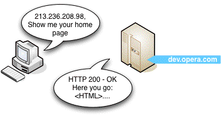

El request es recibido por un servidor, probablemente alojado a miles de kilómetros de distancia, que nos envía el contenido (código HTML, CSS, JavaScript, etc.) dividido en miles de pequeños paquetes. Nuestro navegador recibe esos paquetes, los ensambla, interpreta el código que recibió y nos muestra la página en pantalla. ¡¡Y todo eso pasa en MILISEGUNDOS!! Por supuesto que hay muchísimas más capas de complejidad en todo este sistema, pero para empezar a desarrollar software no es necesario ser expertos en absolutamente todo. De hecho un concepto importante en programación es el de **ignorar la complejidad**: _hay tanta información ahí afuera, que conviene enfocarnos en lo que necesitamos e ignorar el resto. De lo contrario es muy fácil abrumarse con todo lo que no sabemos y bloquearnos._

## Con ustedes... HTML

### Qué es HTML

@vimeo=183592679

HTML es un lenguage tipo **markup** usado para describir la **estructura** y el **contenido** de documentos web (páginas web). Está compuesto por una serie **etiquetas** o **tags** que contienen texto, anidados unos dentro de otros.

HTML es la abreviatura de Hyper Text Markup Language, algo que suena más complicado de lo que en realidad es. Analicemos qué quiere decir cada palabra:

- _Hyper Text_: "Hyper Texto" quiere decir [texto con links](https://es.wikipedia.org/wiki/Hipertexto)
- _Markup Language_: Los "Lenguajes de Marcado" son lenguajes de programación basados en etiquetas que uno agrega a un texto para darle estructura e información adicional. A diferencia de los "Lenguajes de Scripting" que se usan para crear programas informáticos, los lenguajes de marcado son sólo reglas para ordenar un documento.

HTML sirve entonces para dar la **estructura y contenido** a una página web. En el desarrollo front-end(*) se usan tres lenguajes que vamos a estar aprendiendo: HTML, CSS y JavaScript. Para poner una metáfora, si hicieramos una casa con estos lenguajes, HTML vendría a ser la estructura de la casa, CSS sería la decoración y JavaScript la electricidad que permite que la casa tenga cosas copadas.

> (*) En diseño web (o desarrollo web) front-end hace referencia a la parte que visualiza y con la que interactúa el usuario, a diferencia de la parte que que maneja el administrador del sitio con sus respectivos sistemas y bases de datos (back-end) que no es directamente accesible por quienes navegan el sitio.

### Historia de HTML

HTML fue creado a fines de la década de 1980/principios de los 90. En esa época internet se usaba principalmente con fines académicos, para enviar papers y documentos técnicos, pero desafortunadamente sólo se podía enviar texto plano (sin formato). El problema con esto era que no permitía que los textos tuvieran un orden claro, ni permitía linkearlos a otros trabajos, algo fundamental para las citas en los trabajos académicos. Supongamos que tenemos que mandar una tesis usando sólo texto plano:

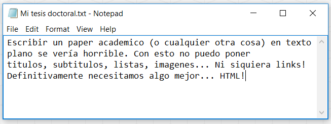

Eso es exactamente lo que nos permite hacer HTML: nos deja tomar texto y contenido de un documento y darle forma usando "tags". Estos tags son piezas de código que envuelven distintas partes del documento y le indican al navegador cómo debe mostrarlas. Por ejemplo, puede indicarle que una parte del texto es un título, que otra parte es un link a otro sitio, que esto va en itálica, que aquello va en negrita, etc. Esto nos permite darle un formato complejo a un documento.

Este lenguaje resultó tan útil que en poco tiempo fue tomado por gente no académica y terminó volviéndose un estándar de internet, particularmente porque podía ser usado por gente sin un background muy técnico gracias a su relativa simpleza.

### Los tags en HTML

#### LA REGLA GENERAL

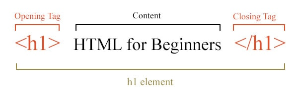

HTML funciona principalmente tomando un contenido, y "haciendo un sándwich" alrededor de él con un tag de apertura y un tag de cierre. Los tags de apertura (opening tag) y de cierre (closing tag) están encerrados entre los símbolos < > y son iguales, con la única diferencia que el tag de cierre empieza con un símbolo /. El contenido que quede encerrado entre el opening tag y el closing tag es lo que se va a ver en la página, tomando diferentes formas según el tag que lo envuelva.

### Estructura de un documento HTML

Escrito por un programador en un editor de texto, no es más que un archivo de texto inerte - un serie de datos escritos en el disco rígido- hasta que el código es **ejecutado** por un intérprete:

```html
<!DOCTYPE html>
<html>
  <head>
    <title>Título de la Página (lo que aparece en el tab del browser)</title>
  </head>
  <body>
    <h1>Mi primer Heading</h1>
    <p>Mi primer párrafo.</p>
  </body>
</html>
```

El propósito de un navegador Web (Chrome, IE, Firefox, Safari) es leer e interpretar un archivo HTML y mostrarlo por pantalla.

Siguiendo las reglas prescriptas de HTML, un web browser lee el código de una página y entiende qué contenido tiene que mostrarle al usuario y de qué forma. Lo siguente es un ejemplo de lo que el intérprete del browser ve cuando lee el código:

- La declaración `DOCTYPE` le avisa al browser que el documento que va a leer es HTML
- El texto entre `<html>` y `</html>` define donde empieza y donde termina el documento HTML
- El texto entre `<head>` y `</head>` provee información sobre el documento llamada **meta data**, data sobre la página pero que no forma parte de su contenido visible. Un ejemplo no-informático de meta data puede ser el género de un libro: si digo que un libro es de aventura le estoy dando al lector información sobre ese documento, pero no le estoy mostrando nada del contenido.
- El texto entre `<title>` y `</title>` provee un título para el documento: lo que aparece escrito en la tab del Chrome, y el texto que muestra Google en sus resultados de búsqueda. Google utiliza esta meta data para entender de que se trata nuestra página y decidir como rankearla (no es el único factor, toma miles más).
- El texto entre `<body>` y `</body>` describe el contenido visible del documento, lo que el navegador le mostrará al usuario.
- El texto entre `<h1>` y `</h1>` describe un encabezado. El tag h1 ('Heading 1') agranda la letra que contiene y la pone como título / encabezado.
- El texto entre `<p>` y `</p>` describe un párrafo. El tag p genera un salto de línea al final, dándole forma de párrafo al texto que contiene.

### Leyendo y Parseando

El browser **parsea** (analiza cada línea de codigo secuencialmente de arriba hacia abajo) el archivo. Todo lo que se incluye dentro del tag `<head>` es **metadata**, es decir información que no será visible para el usuario en pantalla, sino que se usa para construir lo que éste va a ver. Matadata quiere decir datos sobre los datos. El área blanca (todo lo que está adentro del tag `<body>`) es la única parte que aparece visible en la **ventana del browser** (visible para el usuario).

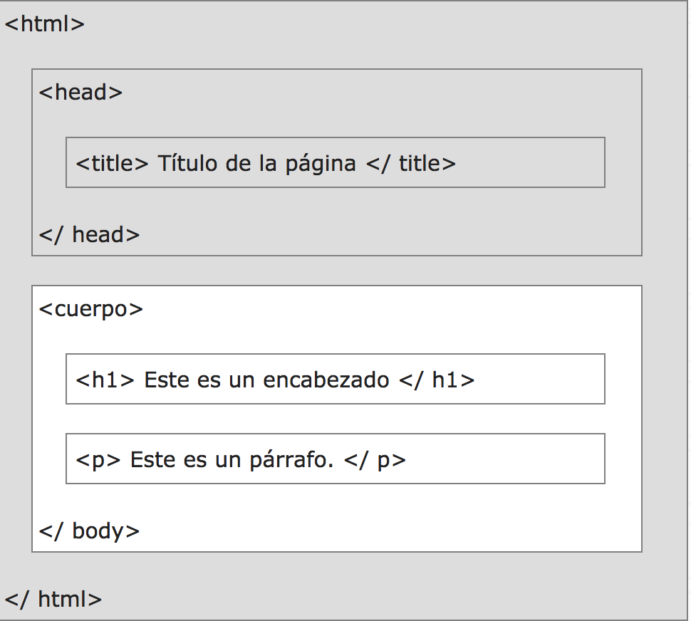

Lo que hace el browser es construir una representación de una página en memoria, que se llama **Document Object Model** (DOM). Los documentos HTML son un conjunto de elementos anidados unos dentro de otros que pueden dibujarse en forma de árbol. Por ejemplo, `<html>` es el elemento que se encuentra más arriba en el árbol y contiene a los elementos `<head>` y `<body>` (y por extensión a todos los elementos que ellos a su vez contienen). Entonces el DOM tiene esta forma:

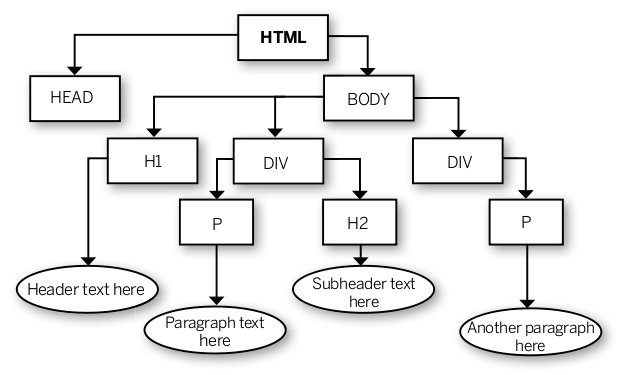

A partir del DOM, el browser dibuja **(renders)** el contenido dentro de su ventana:

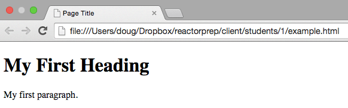

### EJERCICIO: Mi Primer documento HTML

Entrevistá al compañer@ de al lado y creá un documento HTML con una pequeña bio sobre él o ella (si estás sol@ auto-entrevistate). Seguí los siguientes pasos:

1. Creá una carpeta que se llame "plataforma\_5", y adentro creá otra carpeta que se llame "clase\_1" (es importante tener las cosas ordenadas, asi que viene bien ir guardando el código de cada clase en una nueva carpeta)
2. Abrí Atom, creá un File nuevo (**shortcut: Ctrl + N , o Cmd + N en Mac**) y guardalo dentro de la carpeta "clase_1" con el nombre **bio.html** (podés ponerle el nombre que quieras al archivo, pero **siempre tiene que terminar en ".html"(*)**)
3. Dentro del archivo en Atom escribí "html" (sin las comillas) y apretá TAB. Eso te debería completar la estructura básica del documento HTML automáticamente.(**) Si por algún motivo no llega a funcionar escribí a mano la estructura básica del html de arriba.
4. Entre los tags `<body>` y `</body>` incluí el título de la entrevista dentro de un tag `<h1>` `</h1>`
5. Creá un subtítulo para cada sección de la entrevista usando un elemento `<h3>` `</h3>`, incluyendo las siguientes secciones:
  - ¿Que edad tiene tu entrevistad@ y a qué se dedica?
  - ¿Sabe algo de programación?
  - ¿Por qué quiere aprender a programar?
  - ¿Hobbies e intereses? (aparte de programación :D)
  - ¿Cuáles son sus páginas web favoritas?
6. Inmediatamente después de cada `<h3>` `</h3>` escribí la respuesta de tu entrevistad@ dentro de un párrafo, usando el tag `<p>` (la respuesta va escrita entre `<p>` y `</p>`)
7. El tag `<h1>` transforma el texto en un encabezado de texto, agrandando su tamaño y el peso de la letra, el tag `<h3>` es igual pero destacando el texto en una jerarquía menor (existen desde h1 hasta h6) y el tag `<p>` se usa para crear parrafos, generando un salto de línea al final del mismo.
8. Cuando termines de escribir tu código guardá los cambios en el Atom (**shortcut: Ctrl + S**) y abrilo con Chrome para ver el resultado.

> (*) El punto en el nombre del archivo indica el formato del mismo, por lo tanto cómo debe ser tratado ese archivo. Con esto Atom y el browser entienden que es un archivo HTML
> (**) Atom tiene la función de auto completar: si empezás a escribir el nombre de un tag, por ejemplo h1, te debería aparecer un recuadro con el nombre del tag y apretando tab se auto completa.

**Una nota sobre los nombres de los archivos**: Debido a que algunos sistemas informáticos entienden los espacios entre palabras como separadores de comandos, siempre conviene nombrar tus archivos de forma que no tengan espacios. Te recomendamos alguno de estos tres formatos:
- **snake\_case** : palabras\_en\_minuscula\_separadas\_por_underscores (underscore significa guión bajo en inglés)
- **kebab-case** : palabras-en-minuscula-separadas-por-guiones
- **camelCase** : laPrimeraPalabraEnMinusculaYLasSiguientesConMayusculaSinUsarEspacio

## Tipos de Tags

### Elemento Block y Elemento Inline

@vimeo=183594206

Los elementos html que vimos hasta ahora (h1, h2 y p) son elementos de tipo **block**. Esto significa que al crearlos generan una línea, o bloque, que ocupa todo el ancho de la pantalla y empuja a los demás elementos hacia arriba y hacia abajo: "En esta línea voy yo".

Sin embargo, también existen los elementos de tipo **inline**, que ocupan sólo el espacio delimitado entre su opening y closing tag, y que pueden meterse sin problemas dentro de elementos block. Probemos un ejemplo:

1. El tag `<strong>` es de tipo inline y hace que el texto envuelto entre su opening y closing tag se ponga en **negrita**
2. El tag `<em>` ("emphasis") también es de tipo inline y hace que el texto entre su opening y closing tag se ponga en _italica_
3. Volvé al archivo con la entrevista que le hiciste a tu compañero y agregale tags `<strong>` o `<em>` alrededor de las partes más importantes de cada sección
4. Probá combinando ambos tags, haciendo que un texto esté envuelto por por tags `<strong>` y `<em>` al mismo tiempo, de esta forma: `<strong>` `<em>` texto `</em>` `</strong>` (¿funciona igual si los ponemos al revés?)
5. Para terminar de entender la diferencia entre inline y block, andá a uno de los párrafos de la entrevista, agregá un nuevo tag p alrededor de una parte del texto y mirá lo que pasa.
6. El nuevo p genera un nuevo bloque que ocupa todo el ancho de la pantalla y empuja a lo que está afuera hacia arriba y hacia abajo, rompiendo el párrafo que lo contiene.
7. Por último, abrí la página en el browser y usa el inspector de Chrome (**Shortcut: Ctrl + shift + C**, o click derecho - inspeccionar) para ver la diferencia entre un elemento block y un elemento inline. Pasa el mouse por encima de un h1 (¿ves cómo se pinta un bloque que ocupa todo el ancho de la pantalla?) y por encima de un strong (se pinta sólo el texto dentro del tag) para ver la diferencia.


### Ejemplo de Elemento Block

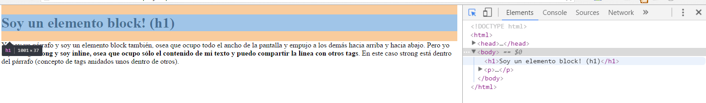

### Ejemplo de elemento inline

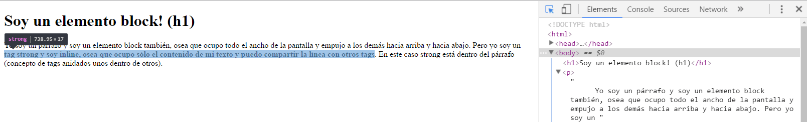

**Una nota sobre el inspector de chrome: la flechita (si tenés mac puede aparecer una lupita) que está arriba a la izquierda del inspector te permite seleccionar elementos html de la página. Si abris el inspector con "Ctrl + Shift + C" ya aparece activado este selector.**

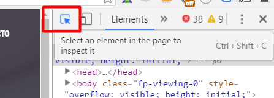

### Viendo el código de otras páginas

1. [Abrí este archivo](http://pledu.plataforma5.la/cursos/coderamp/students/examples/ejercicios/clase_1/ejemplo_saltos_de_linea.html) y mirá el contenido `Cmd + U`, o `Ctrl + U`.
2. Fijate que aunque en el código fuente el texto del párrafo está lleno de saltos de línea, el browser te lo muestra todo de corrido. Eso es porque **HTML ignora si apretas enter o barra**, y sólo hace un salto de línea o un espacio cuando se lo indicás con los tags correspondientes:
  - Para hacer un salto de línea (como poner enter en el word): `<br>`
  - Para poner un espacio (como poner barra en el word):  `&nbsp;`
  - Si ponés espacios con la barra en el código sólo te va tomar el primer espacio, a partir de ahí los ignora.


### Tags Anidados

Como vimos, en html los tags se anidan unos dentro de otros constantemente. El tag `<html>` contiene a los tags `<head>` y `<body>`, que a su vez contienen todo el resto de los tags de la página.

Los ejemplos más típicos de tags anidados son los tags `<ol>` y `<ul>`. `<ol>` quiere decir "ordered list" (lista ordenada en inglés) y sirve justamente para crear una lista donde cada item de la lista está precedido por un número, es decir que tiene un orden, como por ejemplo los pasos en una receta de cocina. `<ul>` en cambio quiere decir "unordered list" (lista desordenada en inglés) y sirve para crear una lista donde cada item de la lista está precedido por un bullet (un puntito negro), es decir que no tiene un orden lógico, como por ejemplo una lista con colores.

Tanto dentro de `<ol>` como de `<ul>` se debe anidar un tag `<li>` (quiere decir "list item") por cada item que querramos que tenga la lista. Entre el opening tag (`<li>`) y closing tag (`</li>`) del li escribimos lo que queremos que se muestre el item.

Escribí este código en el editor de texto y jugá un poco modificando las listas:

```html
<ol>
  <li>Mi primer list item "ordenado"!</li>
  <li>Mi segundo list item "ordenado"!</li>
</ol>
<ul>
  <li>Mi primer list item "desordenado"!</li>
  <li>Mi segundo list item "desordenado"!</li>
</ul>
```

Pero esto no es todo... ¡podemos llevar el anidamiento a otro nivel poniendo una nueva lista dentro de un li! Veamos un ejemplo:

```html
<ol>
  <li>Gatos</li>
  <li>Perros: <ul>
    <li>Scooby</li>
    <li>Lassie</li>
    <li>Doge</li>
  </ul></li>
  <li>Vacas</li>
</ol>
```

Y así sucesivamente. Podemos ir anidando tags unos dentro de otros y metiendo listas dentro de sub listas, o elementos de otros tipos.

## Tags con atributos y Tags auto-contenidos

### ¿Qué son los Atributos?

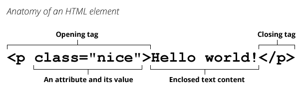

Los tags pueden tener atributos que proveen información adicional sobre un elemento, que se usa generalmente para modificarlo. Estos están siempre en el opening tag de un elemento y están compuestos por dos partes: un **nombre** y un **valor**, separados por un signo igual (=). En el ejemplo de arriba, el tag `<p>` tiene en su opening tag un atributo que indica que es de clase "nice". La próxima clase vamos a ver para que sirven las clases, pero lo importante es que recuerden cómo se le asigna un atributo a un elemento HTML. Un elemento puede tener muchos atributos que hagan diferentes cosas.

### El tag <a>


En el ejemplo de arriba, el primer caso corresponde a un tag `<a>`, llamado "anchor tag" y que se usa para crear links. Veamos su anatomía:

- Se compone de un tag de apertura `<a>` y un tag de cierre `</a>` que delimitan donde empieza y donde termina el tag.
- El opening y closing tag envuelven al texto "Computer Hope", transformándolo en un link visible por el ususario.
- El atributo `href` dentro del opening tag (donde siempre van los atributos) se usa para indicar la dirección a donde deberá llevar el link cuando el usuario haga click. En este caso el valor es "hope.html" que es una página html dentro del sistema local de quien creo el link.
- El `href` puede linkear tanto a páginas locales dentro de sus compus como a páginas externas en internet:
  - En el caso de los archivos locales tienen que escribir el nombre y extensión ("ejemplo.html") del archivo si está en la misma carpeta que la página que tiene el link, o la ruta hacia el archivo de destino si está en otro directorio ("paginas/clase1/pagina.html").
  - En el caso de linkear a una página externa, el valor del atributo tiene que incluir el "http://". Por ejemplo para linkear a Google el valor de href debería ser: `<a href="http://www.google.com"> texto que va a linkear a google </a>`.

### El tag 

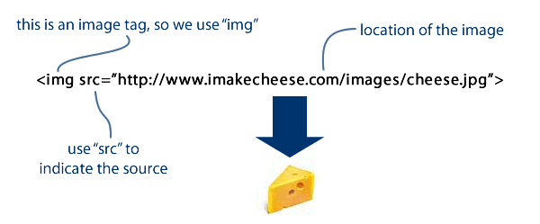

El tag img que vemos arriba también tiene un atributo, que en este caso se llama `src` e indica el lugar donde se aloja la imagen que se debe mostrar, pero vemos que tiene algo diferente a los ejemplos anteriores: **no tiene closing tag** (`</img>`). Algunos tags se componen sólo de un opening tag, ya que no están envolviendo nada. El tag `img` indica al browser que ahí debe ir una imagen y con el atributo `src` le dice dónde tiene que ir a buscar esa imagen.

## EJERCICIO: Crear un Blog

### Un recurso Indispensable Google

¡Vamos a crear nuestro propio blog! Pero antes vamos a conocer un amigo FUNDAMENTAL a la hora de programar: Google.

El mundo de la programación es inmenso y lleno de detalles, por lo que no tiene sentido pretender saber todo. La mejor forma de surfear la incertidumbre y abrirnos camino cuando nos encontremos con un problema va a ser googlear. Todos los problemas que tengamos ya le pasaron a alguien antes que a nosotros, y lo más probable es que la respuesta a ese problema ya esté en internet. Si tenemos dudas sobre tags HTML por ejemplo, es tan fácil como buscar en Google "HTML (nombre del tag)". Van a ver que hay sitios excelentes como http://www.w3schools.com/ con los que se van a encontrar una y otra vez. [¡Gracias Larry](https://es.wikipedia.org/wiki/Larry_Page), [gracias Sergey!](https://es.wikipedia.org/wiki/Sergu%C3%A9i_Brin)

### Objetivo

Creá una página para un blog de la temática que más te guste. Tiene que tener todos los elementos de la lista de abajo. Hay algunos elementos que todavía no vimos, asi que vamos a aprovechar para ejercitar tu capacidad de búsqueda. Acordate que es tan fácil como buscar HTML y el nombre del tag (por supuesto que podés preguntarnos por Slack todo lo que necesites, estamos para ayudarte, pero es importante para un programador desarrollar esta capacidad de búsqueda y resolución de problemas).

Una lista detallada de instrucciones esta en la siguiente sección

### Instrucciones

1. Creá un archivo HTML nuevo en Atom, escribí a mano la estructura báscia para practicar, (doctype, tags html, head y body) y guardalo con la extensión .html al final.
2. La página deberá tener un titúlo dentro del `<title>` tag en el head (es el título que aparece en la pestaña del browser, y lo que muestra google en el resultado de las búsquedas).
3. Ya dentro del body incluí un tag `<nav>` para crear una barra de navegación en la parte superior de la página, con links (`<a>`) que lleven a otras páginas.
4. Por lo menos uno de esos links debe llevar a otra página HTML creada por vos, por ejemplo a una página de "About Us", o a una página con imágenes. Para hacer esto, escribí el nombre del archivo html al que quieras dirigir dentro del atributo href= . Por ejemplo, si creas una página about_us.html y querés linkearla desde tu blog, deberías ponerlo así: `<a href="about_us.html">About Us</a>`. Ambos archivos deberían estar en la misma carpeta.
5. Usá por lo menos tres tipos diferentes de tags de heading (h1,h2...h6) para diferenciar distintas partes de tu contenido.
6. Creá una lista ordenada (cada item tienen un número) usando el tag `<ol>` y una lista desordenada (cada item tiene un bullet) usando el tag `<ul>`. Investigá cómo se usan buscando en Google.
7. Usá algunos tags inline tipo `<em>` y `<strong>` para destacar partes del texto.
8. Buscá en google un tag inline que te permita subrayar un texto.
9. Usá algunos tags tipo `<br>` y `<hr>`
10. Incluí alguna foto de perfil sacada de tu computadora o de la web (A los usuarios le copan las imágenes!).
11. Hacé que esa foto linkee a tu perfil de facebook.
12. Transformá algunas palabras o frases en links que lleven a páginas externas.
13. Pongamos algunos mensajes secretos que los visitantes sólo puedan ver si abren nuestro código fuente usando Crtl + U / Cmd + U, o el inspector de chrome! (tip: Buscá en google "comentarios HTML").

> Los comentarios en los lenguajes de programación son comandos que le indican a la computadora que ignore esas líneas de código, y se usan para dejarle mensajes a otros humanos que lean el código. El código en una página o programa crece rápidamente y se vuelve confuso, por lo que es muy importante ponerle comentarios para explicar qué hace cada parte del código. Los programadores siempre trabajan por otras personas, y es crucial tener un código que sea fácilmente comprensible por otros.


### Deploy!

¡Excelente trabajo! Ahora subamos nuestra página y expongámosla en internet.

1. Entrá a [Bitbaloon](https://www.bitballoon.com/), un hosting estático(*) gratuito (no hace falta que crees una cuenta).
2. ¡Voilá! Ya tenés tu primera página subida a internet-
3. Copiá el link y compartilo en Slack
4. Abrí el link que te pasaron tus compañeros y lee su **código fuente**, fijate si te dejaron algún mensaje secreto escondido

**¿Terminaste?** Si te sentis listo, mirá este [documento de referencia de HTML](https://developer.mozilla.org/en-US/docs/Web/HTML/Element) el cual lista todos los tags HTML disponibles. Vamos a ver algunos de ellos en detalle más adelante, pero muchos son muy extraños y de propósitos muy específicos como para perder tiempo en ellos, leelos si estás interesad@, pero no te asustes, ¡a la mayoría nunca los vas a usar!

> (*) Un sitio estático es una colección de archivos HTML guardados como archivos en el sistema de archivos de un servidor web. Estos son entregados al usuario exactamente como están guardados (como un blog), en contraste a las aplicaciones web dinámicas que son generadas dependiendo del usuario y del estado de la aplicación (Como Facebook o Instagram)

## Contenido Bonus

### Lenguajes de Programación vs. Lenguajes Markup

Un **lenguaje de programación** es una construcción formal diseñada para comunicar instrucciones a una máquina, en particular a una computadora. En general, un lenguaje tendrá tres capacidades básicas para generar flujos de procesos: i) la secuencial (secuencias de instrucciones), ii) la condicional (capacidad para tomar decisiones o ejecutar un proceso u otro en función del valor de uno o varios parámetros) y iii) la de repetición (capacidad para repetir un proceso un cierto número de veces).

Diferentes lenguajes tienen distintas sintaxis: la sintaxis de un programa describe las posibles combinaciones de símbolos (palabras, signos, números, etc...) para escribir un programa de forma correcta. Es la **forma** con la que se escribe en ese lenguaje.

También existen otros tipos de lenguajes que no tienen las tres capacidades antes mencionadas, si no que son lenguajes declarativos. A estos lenguajes se los conoce como Markup Languages (Lenguajes de Marcado) y consisten en secuencias especiales de carácteres códificados para especificar el diseño y el estilo deseado para el texto.

Ya habíamos visto que HTML era un lenguaje de tipo Markup, pero existen otros. **Markdown** por ejemplo es otro lenguage de tipo Markup, que es mucho más reducido en sus capacidades, pero se usa mucho para escribir textos como blogs o descripciones de códigos de programación, porque es más simple y rápido. ([Acá hay algunas razones más para usar Markdown](http://brettterpstra.com/2011/08/31/why-markdown-a-two-minute-explanation/))

### Probando Markdown:

Copiá este código Markdown al editor Atom y apretá "Ctrl + Shift + M" (Cmd + Shift + M en Mac) para abrir el 'markdown preview', que te muestra cómo se va a ver (cómo se **renderiza**) el código que escribís.

```md
\# Esto es un Header
\## Este es un header más pequeño
\### Todavía más pequeño...
\###### demasido pequeño

Acá va un poco de texto normal. Un parráfo, inclusive!

*Este texto está en itálica.*

**Soy un texto en negrita.**

***Este texto está en las dos.***

~~Este texto está dibujado como tachado.~~

También podés embeber \*texto estilizado\*
dentro **de tú parráfo.** Bastante copado, no?!

* Item
* Item
* Otro item (con voz del chavo)...

o

+ Item
+ Item
+ Uno más

o

- Item
- Item
- El último...


1. Item uno
2. Item dos
3. Item tres

w/ sub-listas

1. Item uno
2. Item dos
3. Item tres
    1. Sub-item
    2. Sub-item
4. Item cuatro

---

[Soy un link a una página!](http://www.google.com)


```

Si querés aprender más Markdown podés encontrar una muy buena guía [acá](https://learnxinyminutes.com/docs/markdown/). Vas a tener algo nuevo para cancherear con tus amigos o levantar chic@s geek ;)

### Un Experimento Interesante

¿Nunca te preguntaste cómo hace el Word para darle estética al texto cuando por ejemplo lo cambias de color, o lo ponés en negrita? ¡Ahora que sabés programar podés averiguarlo! Hagamos lo siguiente:

1. Creá un archivo nuevo en Word, escribí algo y empezá a darle estilo al texto.
2. Cambiale algunas letras de tamaño, poné otras en negrita, subrayá un pedazo, cambiales los colores, creá listas de bullets, etc.
3. Guardá el archivo, andá a la carpeta donde está, hacele click derecho encima y elegí la opción "abrir con Atom"...

¿¡QUÉ ES TODO ESTO!? Los caracteres raros que ves son códigos que Word le agrega al texto para cambiarle el formato y que atom no sabe interpretar porque estan en un lenguaje de Microsoft.

Cuando en las próximas clases le demos estilo al nuestro HTML vamos a hacer lo mismo que hace Word, pero usando otro lenguaje que se llama CSS. CSS es un lenguaje de Markup que se usa para decorar las páginas y hacer que se vean increíbles. ¿listo para empezar?