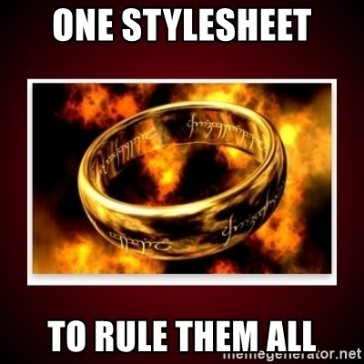
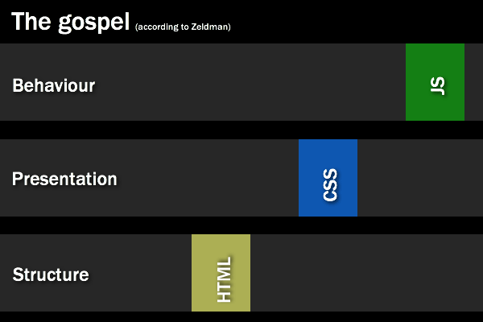
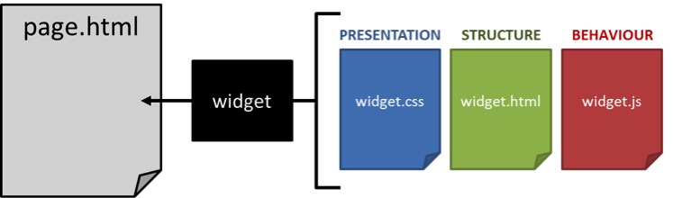
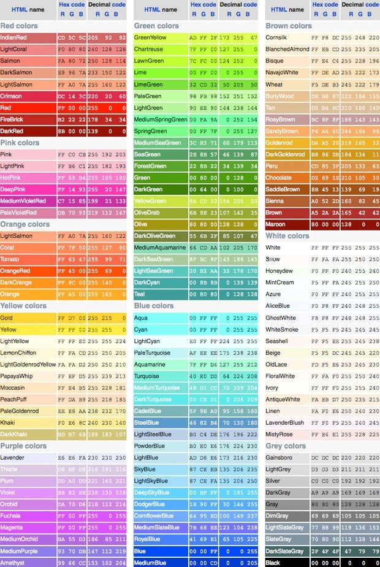
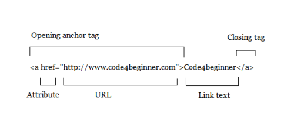

# 02- CSS

## Introducción

### Objetivos

- Aprender qué es CSS
- Aprender la sintaxis de CSS (la forma correcta de escribirlo)
- Aprender las tres formas de incluir CSS en un documento HTML:
  - Usando el atributo style (forma INCORRECTA)
  - Usando el tag `<style>` dentro del `<head>` de la página (forma INCORRECTA)
  - Usando un archivo separado con las reglas CSS (forma CORRECTA)
- Entender qué es un selector CSS y utilizarlo para cambiar el aspecto de elementos HTML
- Entender los conceptos de herencia y especificidad en CSS

## CSS

### Qué es CSS

@vimeo=593195673

CSS significa Cascading Style Sheets, y es el lenguaje que se usa para aplicar cambios estéticos a los documentos HTML. Con CSS vamos a componer hojas de estilo (archivos separados con extensión ".css") que indicarán cómo se verán los distintos elementos (`<p>`, `<h1>`, `<ul>`, etc. etc.) de uno o más documentos HTML. Al igual que HTML, que va por su quinta versión y habitualmente lo encontramos escrito como HTML5, CSS va por su tercera versión, por lo que habitualmente lo vamos a encontrar escrito como **CSS3**. Por fines prácticos en este contenido vamos a usar los términos CSS y CSS3 indistintamente. Si empezas a sentir mariposas en la panza (te estás enamorando) y querés sabér más sobre la evolución de CSS acá tenés [una breve historia del lenguaje](http://librosweb.es/libro/css/capitulo_1/breve_historia_de_css.html).

Volviendo a la metáfora de la casa, si HTML servía para construir las paredes y la estructura de la casa, CSS sirve para decorarla y hacer que se vea espectacular. Noten que una misma casa puede estar decorada de formas totalmente distintas y tomar apariencias muy variadas. Lo mismo ocurre con CSS. El sitio [CSS Zen Garden](http://www.csszengarden.com/) nos da un ejemplo excelente de esto: a partir de un mismo documento HTML, nos muestra muchísimas alternativas de como presentarlo usando CSS. Veran que cada estilo hace que la misma página se vea totalmente diferente, e incluso tenga efectos increíbles.

> En adelante vamos a usar los términos "hoja de estilos", "stylesheet" y ".css" indistintamente. Todos refieren al archivo que contiene las reglas css que aplicamos a nuestro(s) html.

### Cómo escribir CSS

La sintaxis básica de CSS se compone de la siguiente manera:

- Un **selector**, es decir un comando que selecciona uno o más elementos del documento HTML, por ejemplo el `<body>`, los `<p>`, etc.
- Al selector le siguen **llaves { }** que contienen los estilos (cambios estéticos) que queremos darle a los elementos selceccionados
- Dentro de las llaves se escribe una **propiedad css** que queremos modificar (el color, el tamaño de la letra, etc) y un valor para esa propiedad, **separados por dos puntos (:)**
- Pueden enumerarse muchas propiedades a modificar al mismo tiempo, **separándolas con un punto y coma (;)**

El código se ve de esta forma:

```css
selector { 
  propiedad: valor; 
  otraPropiedad: valor; 
} 
```


Todo el código CSS que escribamos va a seguir esta estructura. Veamos algunos ejemplos:

```css
h1 { 
  font-family: verdana; 
}
```

El ejemplo de arriba selecciona todos los elementos h1 del documento, y les cambia el font-family (la tipografía) a verdana.

```css
p { 
  color: green; 
  background-color: yellow; 
}
```

El ejemplo de arriba selecciona todos los elementos p del documento, y les cambia el color al valor green (la propiedad color refiere al color de la letra) y el fondo a amarillo.

```css
em {
  font-size: 300%;
}
```

El ejemplo de arriba selecciona todos los elementos em del documento (recuerden que era el tag inline que usabamos para envolver una parte del texto y hacerla italica), y les cambia el atributo font-size al valor 300%, es decir que ahora además de poner al texto que contiene en itálica, va a aumentarle el tamaño de la letra.

Podemos poner muchas reglas seguidas, escribiendo cada una en una línea nueva. En el caso de arriba sería:

```css      
h1 { 
  font-family: verdana; 
}

p { 
color: green; 
background-color: yellow; 
}

em {
font-size: 300%;
}
```

Notá que estos ejemplos usan selectores de elementos HTML genéricos (h1, p, em), es decir que seleccionan todos los elementos h1, todos los párrafos y todos los em, y los modifican. Más adelante veremos otros selectores más específicos, para seleccionar elementos HTML individuales, por ejemplo un párrafo en particular, o un h1 puntual del documento. No te pongas ansios@ ;)

[code_anxiety](code_anxiety.jpg)

> **Una nota sobre las propiedades css:** Hay muchísimas propiedades css que se pueden modificar, acá hay una [lista ridículamente exhaustiva](https://developer.mozilla.org/en-US/docs/Web/CSS/Reference) por si quieren investigar. No se asusten, por ahora vamos a limitarnos a las propiedades más comunes que se usan todo el tiempo, pero si quieren probar algo nuevo ahí tienen para divertirse :)

## Tres formas de Incluir CSS

### Forma 1: mediante el atributo style (INCORRECTA)

@vimeo=596392629

Esta primera forma de incluir CSS es la única que usa una estructura un poco distinta a la que vimos antes. Para incluir CSS de esta forma, en vez de usar un selector, directamente le agregamos el atributo `style` al elemento HTML que queremos modificar y le asignamos como valor un "key-value pair" (un par propiedad-valor), indicando la propiedad css que queremos cambiar y el valor correspondiente.

### Ejercicio

¡Probalo vos mism@! Creá un nuevo documento HTML nuevo y probá lo siguiente:

**Escribilo a mano sin usar copy & paste, sólo te haces trampa a vos mism@.**

```html
<body style="background-color:lightgrey">
  <h1 style="color:blue">Esto es un heading</h1>
  <h2 style="color:#BA521F">Otro heading</h2>
  <h3 style="color:rgb(120,234,88)">Maas!!</h3>
  <p style="color:red;background-color:green">Esto es un párrafo.</p>
  
</body>
```

Usar el atributo style tiene un claro problema de escalabilidad(*). Imaginen que tienen una página con 100 párrafos y quieren cambiarles el tamaño de la letra. Si hubieran usado el atributo style tendrían que escribir un código por párrafo, ¡repitiendo lo mismo 100 veces! Claramente no debemos usar el atributo style :S

> (*) vamos a usar mucho los términos 'escala' o 'escalabilidad' durante el curso. Con esto nos referimos a escenarios donde hay muchísimas páginas o elementos, como ocurre con muchos sitios reales (piensen en Facebook). En estos sitios se necesitan soluciones que no generen trabajo extra a medida que el sitio crece, es decir que sean escalables. Si necesito escribir código por cada página que agrego, entonces cuando mi sitio tenga 1 millón de páginas voy a tener un problema. Es decir, esa solución no escala.

### Forma 2: mediante el tag <style> (INCORRECTA)

> **Incorrecta**, salvo para testear algo rápido

El tag `<style>` se aplica dentro del `<head>` tag al principio del documento HTML, y contiene las reglas CSS entre su opening (`<style>`) y closing tags (`</style>`). Ahora sí, las reglas CSS se escriben como vimos al comienzo, usando un selector seguido por llaves que contienen las propiedades a modificar. ¡Practiquemos un poco!

### Ejercicio

Vamos a refactorear(*) el código CSS que escribiste arriba usando el **tag `<style>`**:

1. Creá un tag `<style>` dentro del tag `<head>` del documento HTML
2. Para cada elemento html, copiá las reglas css que están dentro de "style=..." y reescribilas dentro del **tag** `<style>`, usando el formato que vimos al principio: selector { propiedad:valor; otraPropiedad:valor;}
3. Una ayuda para empezar, el primero debería verse así: 
```html  
<body style="background-color:lightgrey">
```
```css      
body { 
  background-color: lightgrey; 
}
```
4. A medida que pases cada regla dentro del tag `<style>` borrá el atributo "style=...." del elemento html correspondiente. En el ejemlpo de arriba, una vez que pasamos la regla css, el opening tag del body debería quedar así `<body>`

Usar el tag style nos permite escalar mucho más que si usamos el atributo style dentro de cada elemento HTML que queremos cambiar. Ahora declarando una única regla dentro del tag style podemos cambiar muchos elementos al mismo tiempo. Volviendo al ejemplo anterior, si tenemos 100 párrafos y queremos cambiarles el tamaño de la letra, sólo hace falta escribir una vez: `p { font-size: 40px }`

Sin embargo el tag style tampoco escala como necesitamos, porque sus reglas se limitan únicamente a la página que lo contiene. Si quisieramos aplicar el mismo cambio en 100 páginas diferentes deberíamos escribir ese mismo código en cada una de esas 100 páginas. Imaginen que son Wikipedia y quieren cambiar la tipografía de sus [más de 5 millones de artículos](https://en.wikipedia.org/wiki/Wikipedia:Size_of_Wikipedia)... claramente no podemos usar el tag style :S


> (*) Refactorear significa re-escribir un código para que haga lo mismo de forma más eficiente.

> Disclaimer: podemos usar el tag style para probar cambios rápidos en una página, pero el código CSS final siempre tiene que quedar guardado en un archivo separado como vamos a ver a continuación

### Forma 3: Trar el código de un archivo .css externo (CORRECTA!)

Para solucionar los problemas que vimos antes, la forma correcta de incorporar CSS en nuestro HTML va a ser usando el tag `<link>`. El tag link trae las reglas CSS contenidas en un documento externo y tiene 3 atributos clave que tenemos que escribirle (en realidad tiene más, pero vamos a limitarnos a estos para nuestro propósito):

- ej: `<link href='mis_estilos.css' rel='stylesheet' type='text/css'>`
- El atributo **href**, que indica la dirección de donde vamos a traer el archivo con las reglas CSS. Esta dirección va siempre entre comillas, al igual que lo hacíamos en el tag `<a>` que usábamos para crear links.
- El atributo **rel**, que siempre lleva el valor **"stylesheet"**, indicando que el archivo que estamos trayendo es una hoja de estilos CSS.
- El atributo **type**, que siempre lleva el valor **'text/css'** indicando que el contenido que traemos será texto y reglas CSS.

### Ejercicio

Vamos a pasar el código CSS que creamos dentro del tag style en el punto anterior a un archivo CSS externo y traerlo usando el tag `<link>`:

1. Creá un archivo nuevo y guardalo en la misma carpeta donde está tu archivo HTML con el nombre "mis_estilos.css" (podes ponerle el nombre que quieras, lo importante es que termine en .css)
2. No pongas nada de HTML en "mis_estilos.css", simplemente pasá las reglas CSS que tenías escritas dentro del tag style del documento HTML original. Ese debería ser el único contenido del archivo (sin el tag style, sólo las reglas css).
3. El contenido de "mis_estilos.css" debería verse como una sucesión de reglas de este tipo: 
```css
body { 
background-color: lightgrey; 
}
```
4. Una vez que hayas copiado las reglas CSS a "mis \_estilos.css", borrá el tag style (y su contenido) del documento HTML original y reemplazalo por un tag link, poniendo como valor de **href** "mis_estilos.css" (o el nombre que le hayas puesto a tu archivo .css)
5. Guardá ambos archivos, el HTML y el .css y recargá la página en el browser. ¡Debería verse igual que antes!

¡Excelente! Ya tenemos una forma para escalar nuestras reglas CSS a todo el sitio, no importa cuanto crezca. Si cada nueva página HTML que creamos se vincula a un único archivo CSS, cambiando ese archivo afectamos a todas las páginas HTML al mismo tiempo. No importa que nuestro sitio tenga millones de páginas, mientras todas linkeen a un único CSS, modificar ese único archivo alcanza para impactarlas a todas.



### Separación de Tareas

Como ya mencionamos, un concepto clave en el desarrollo Front End (programación de todo lo que interactúa con el usuario) es el de "separation of concerns". Básicamente significa que cuando hacemos un sitio, cada lenguaje tiene un rol y sus respectivos códigos deberían estar en archivos separados (pero vinculados, como acabamos de hacer con el tag link para unir un html y un css). Estas imágenes lo resumen bien (no se preocupen por la parte de JavaScript, ya vamos a llegar):



En la práctica los archivos quedan separados, pero vinculados entre sí, y muestran el resultado final deseado (page.html) cuando el usuario accede a la página.



## Más CSS

### Colores en CSS

@vimeo=596395274

CSS nos permite escribir los colores de tres maneras diferentes **indistintamente**:
- Con su nombre en inglés. Ej. red, green, blue, purple
- Con su [código hexadecimal](https://es.wikipedia.org/wiki/Sistema_hexadecimal), una secuencia de 6 dígitos entre 0 y F precedidos por un signo '#'. Ej.#CD00CD (magenta)
- Con RGB (red, green, blue), dándole un valor entre 0 y 255 a cada uno de los tres colores. Ej. rgb(210, 140, 176).

Entonces, escribir "background-color: lime;", "background-color: #00FF00;" o "background-color: rgb(0,255,0);" daría el mismo resultado, un fondo color lima. Esto es muy útil porque los diseñadores nunca les van a pasar el nombre de un color, sino que les van a dar un tono específico en hexa o en rgb.

Estos dos recursos están muy buenos para buscar colores:
1. La página [coolors.co](https://coolors.co/)
2. Esta lista de colores con sus códigos hex y rgb:



#### RGBA

Existe un cuarto formato que es el de **rgba**, que es igual a RGB pero con un cuarto valor **entre 0 y 1** que refiere a la **transparencia** del color. Entonces por ejemplo **rgba(0, 255, 0, 0.5)** genera un color lime pero con un tono más transparente.

### Heredando Estilos

La clase pasada vimos que HTML se construye anidando elementos unos dentro de otros, creando un árbol llamado el DOM (Document Object Model). Muchas reglas CSS son hereditarias, es decir que si se las asignamos a un elemento HTML (padre, o parent), esa regla derramará a los elementos que contenga dentro de él (sus hijos, o children). Vamos a probarlo:

- Creá un documento HTML nuevo y dentro de el body creá un título usando un tag `<h1>` y una lista desordenada con 4 items usando un tag `<ol>`
- Creá una hoja de estilo nueva y vinculala al archivo html usando el tag `<link>`
- En la hoja de estilo usa un selector de elemento para seleccionar el body ( body {...}) y dale la propiedad color: red
- Guardá los cambios en la hoja de estilo y abrí el html en el google chrome ¿De qué color se ven los textos de la página?
- Lo que pasó fue que la regla aplicada al body fue heredada por sus elementos hijos, que se pintaron de rojo.
- Ahora seleccioná el elemento ol y dale una propiedad color: purple
- ¿Qué pasó? Al asignarle un color específico a `<ol>` sobreescribimos la regla que heredaba de su padre.

## Selectores Específicos


### Modificando Elementos HTML Puntuales

@vimeo=186371266

Ok, hasta ahora todo bien. Bueno, casi. Estuvimos usando como selectores css los nombres de elementos html genéricos (p, h1, i, etc), lo cual selecciona todos los elementos de ese tipo en la página html y los modifica. Pero ¿que pasa si quiero cambiar un único elemento en todo el documento? Supongamos que estamos estudiando para la facu y queremos resaltar un párrafo específico que tiene un concepto clave (eh... si, supongamos también que somos super tecno nerds y estudiamos de archivos html). Con lo que vimos hasta ahora estaríamos en un problema porque seleccionaríamos todos los párrafos al mismo tiempo. Por suerte hay una solución que vamos a usar mucho de acá en adelante.

### El atributo id

Volvamos un segundo a lo que vimos la clase pasada sobre los elementos html y sus atributos:



Un elemento html puede tener atributos dentro de su opening tag. En el ejemplo de arriba el elemento `<a>` (un link) tiene dentro de su opening tag un atributo "src" con el valor de una url, que le indica al tag `<a>` a dónde tiene que llevar a la gente cuando hagan click dentro de su texto "Code4begginer".

Todos los elementos html pueden tener un atributo llamado "id" con el que les podemos dar un **identificador único** para después seleccionarlos específicamente. Podemos ponerle el nombre que querramos usando números y letras (**ojo que no puede empezar con un número**), por ejemplo `<p id="primerId"> </p>`. Ahora ese párrafo va a tener un id llamado **primerId**, que podemos usar para seleccionarlo específicamente en CSS. Los ids deben ser **únicos**, no debemos usar un mismo id para dos elementos distintos. Si queremos seleccionar más de una cosa al mismo tiempo podemos usar una clase, algo que veremos en un ratito.

En CSS, para seleccionar un elemento html específico a través de su id tenemos que escribir un numeral (#) con el id pegado. Entonces, el selector CSS para el ejemplo de arriba sería #primerId (con eso lo tenemos seleccionado). Si quisiéramos que sólo el párrafo de arriba estuviera resaltado en amarillo, simplemente tendríamos que escribir en nuestra hoja de estilo:

```css
#primerId {
  background-color: yellow;
}
```

### El Atributo class

Ahora, ¿qué pasa si seguimos leyendo y nos damos cuenta que queremos resaltar más de un p, porque hay varios párrafos con conceptos importantes? Dijimos que el id era único por elemento, asi que si quisiéramos usarlo para resaltar muchos párrafos tendríamos que crear un id por cada párrafo que quisiéramos resaltar y escribir una regla css para cada uno. Estaríamos repitiendo mucho código y sería totalmente ineficiente. Por suerte existe **el atributo class**, que es como id pero puede ser compartido.

El atributo class se escribe igual que id, por ejemplo `<p class="primerClass"> </p>` (ahora ese p es de la clase "primerClass") y puede ser seleccionado en CSS usando el punto (.) pegado al nombre de la clase. Entonces, para modificar todos los elementos de clase "primerClass", en CSS deberíamos escribir:

```css
.primerClass {
  font-size: 200%;
}
```

Para seguir con el ejemplo del estudio, si quisieramos resaltar varios párrafos importantes, podríamos asignarle una class="importante" a cada párrafo que quisiéramos resaltar, y crear una regla en CSS que use como selector '.importante'. Quedaría:

```css
.importante {
  background-color: lime;
}
```

Un elemento HTML puede tener sólo un id (que debe ser usado únicamente en ese elemento), pero puede tener muchas clases al mismo tiempo, compartidas con otros elementos. Esto tiene sentido. Imaginemos que mi perro Coquito es un elemento html. Él es único, por lo que podría tener un id="coquito" que nadie más compartiría. Pero coquito tiene muchas otras características (clases) que podría compartir con otros perros, por ejemplo class="petizo", class="gordo" o class="galan". Si quisiéramos darle todas estas clases a un elemento al mismo tiempo tendríamos que escribirlas dentro del atributo class, una atrás de otra, separadas por un espacio. Se vería de esta forma: `<p class="petizo gordo galan"> </p>`. Con esto asignamos las clases a nuestro elemento en el archivo .html, y después tendríamos que darle estilos a cada una de esas clases ( .petizo {...}, .gordo {...} y .galan{...} ) en nuestro archivo .css. Como es de esperar, un elemento puede tener un id y una o más clases al mismo tiempo.

(Coquito)


### Ejercicioooooooo

Vamos a practicar todo esto. Agarrá tu sable láser y entrá a [esta página](http://pledu.plataforma5.la/cursos/coderamp/students/examples/ejercicios/clase_2_ejercicio_clases_ids_css_starwars/ejercicio_clases_ids_css_starwars.html). ¡Que la fuerza te acompañe!

1. Hacé click derecho en la página e ingresá a su código fuente (shortcut: Ctr+U en pc, o Cmd+U en mac).
2. Copiá ese código y pegalo en un archivo html nuevo.
3. Creá una hoja de estilo nueva y vinculala al html creando un nuevo tag link debajo del que ya tiene (un html puede estar vinculado a más de una hoja de estilo sin ningún problema).
4. Dentro de tu css creá una clase para el imperio que genere un background-color red, y asignásela a cada uno de los miembros del imperio en los opening tags de sus `<li>` dentro del archivo html.
5. Hacé lo mismo para los rebeldes, pero que la clase genere un background-color blue.
6. Creá un id para Darth Vader que aumente el tamaño de la letra de su nombre y un id para Luke que lo ponga en itálica.
7. Creá una clase para los soldados que les defina un borde a rayas usando la propiedad de css border (buscá en google qué valores podés darle a border).
8. Creá una clase para los soldados que aumente el espacio entre sus letras con la propiedad de css letter-spacing.
9. Creá una clase para las unidades de apoyo y centralas con la propiedad de css text-align.
10. Creá una clase para las naves y buscá en google un atributo css que te permita poner todas las letras de sus nombres en mayúscula.

### La especificidad en CSS

¿Que pasa si creamos reglas css contradictorias, por ejemplo una regla que le aumenta el tamaño de la letra a los párrafos, y otra que se los reduce?

**Vamos a averiguarlo**: volvé a la hoja de estilo del último ejercicio y creá una regla que seleccione p y le cambie la propiedad 'font-size' a 10%. Inmediatamente después creá una regla igual pero que cambie el font-size a 400%. Guardá los cambios, volvé a tu html y refrescá la página ¿Qué tamaño de letra tienen los párrafos?

Cuando CSS encuentra reglas contradictorias, usa la **especificidad** para decidir que regla gana. Cuando creamos un selector, CSS le asigna un valor a su especificidad que varía según el tipo de selector:
 
- El selector de elemento, es decir cuando seleccionamos elementos HTML genéricos: p {...}, h1 {...}, etc) tiene una especificidad de 1, y es el menos específico.
- El selector de clase (.ejemplo {...}) tiene una especificidad de 10.
- El selector de id (#ejemplo {...}) tiene una especificidad de 100.

Si hubieran reglas contradictorias entre las tres de arriba ganaría el id, por ser la de mayor especificidad.

**Importante:** si hay dos reglas contradictorias con la misma especificidad gana la que esté más abajo en el CSS, osea la última que fue declarada. Para probarlo, volvé a la hoja de estilo y cambiá el orden de las reglas que cambiaban el tamaño del párrafo.

Esta página te puede resultar útil para calcular la especificidad de distintos selectores y entender qué regla prevalecerá: https://specificity.keegan.st/. No te asustes por los selectores raros que aparecen ahí, son selectores complejos que vamos a ver más adelante.

## Contenido Bonus

### Propiedades con múltiples valores

Casi todos las propiedades css que vimos tenían un único valor, por ejemplo "background-color: yellow", pero algunas propiedades pueden tener muchos valores, referentes a distintos aspectos de la propiedad. Un ejemplo de este tipo es la propiedad **border**, que usaste en el ejercicio anterior. Dentro de border podemos escribir por ejemplo: "border: 3px solid red", dándole a border un ancho de 3 pixels, haciéndolo una línea solida (a diferencia de "dashed" por ejemplo, que la hace con rayitas) y de color rojo. Si omitimos alguno de esos valores, ese aspecto del borde se setea en su valor default. Más adelante vamos a ver otros ejemplos de atributos de este tipo.

### Hojas de estilo Internos o Externas

Podemos usar hojas de estilo que se encuentren en nuestra computadora completando el atributo "href=" con la dirección del archivo en nuestra computadora. Si el archivo .html y el .css están en la misma carpeta, alcanza con poner sólo el nombre del archivo .css en el "href=", por ejemplo `href="mis\_estilos.css"`. Si el archivo está en otra carpeta tenemos que poner la ruta hacia ella, tomando como origen la carpeta donde se encuentra el archivo .html, por ejemplo `href="stylesheets/mis_estilos.css"`, si la hoja de estilos estuviera en una carpeta llamada stylesheets, ubicada en el mismo lugar que el archivo .html.

Si quisieras referenciar a archivos ubicados en otros directorios (otras carpetas) más lejanos dentro de nuestra compu, pueden investigar [esta página](https://stackoverflow.com/questions/14489016/how-to-properly-reference-local-resources-in-html) que da algunos ejemplos de como navegar entre carpetas. Por ahora mantengamos los archivos .html y .css en la misma carpeta para que nos resulte más fácil.

Otra opción es acceder a hojas de estilo en la web. La unica diferencia es que en vez de poner el nombre del archivo local, completamos el atributo "href=" con la url que tiene la stylesheet. Por ejemplo: `href="https://maxcdn.bootstrapcdn.com/bootstrap/3.3.7/css/bootstrap.min.css"`. Si bien se ve más largo, esto es simplemente un archivo .css guardado en un servidor (una compu en algún lugar) al que accedemos a través de internet.

